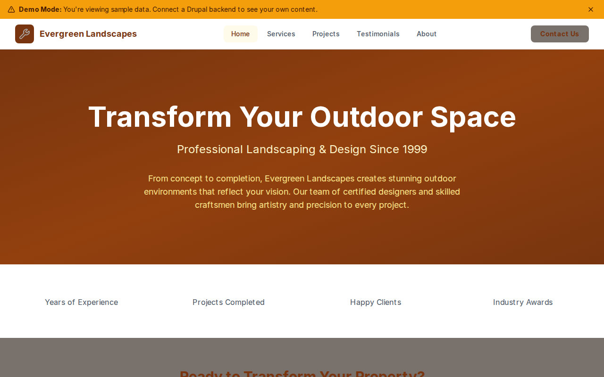

# Decoupled Landscaping

A professional website starter for landscaping companies, garden designers, and outdoor living businesses. Built with Next.js 15 and Drupal CMS, this starter showcases services, project portfolios with galleries, and client testimonials to help landscaping businesses attract and convert leads.



[](https://vercel.com/new/clone?repository-url=https://github.com/nextagencyio/decoupled-landscaping&project-name=landscaping-site)

## Features

- **Services** -- Present landscaping offerings with summaries, price ranges, typical durations, and detailed descriptions
- **Projects** -- Showcase completed work with client names, locations, project types, completion dates, and image galleries
- **Testimonials** -- Display client reviews with ratings, service received, location, and optional photos
- **Homepage** -- Eye-catching hero section, company statistics (years, projects, clients, awards), featured services, and call-to-action
- **Basic Pages** -- Static content for About, Contact, and company information

## Quick Start

### 1. Clone the template

```bash
npx degit nextagencyio/decoupled-landscaping my-landscaping-site
cd my-landscaping-site
npm install
```

### 2. Run interactive setup

```bash
npm run setup
```

This interactive script will:
- Authenticate with Decoupled.io (opens browser)
- Create a new Drupal space
- Wait for provisioning (~90 seconds)
- Configure your `.env.local` file
- Import sample content

### 3. Start development

```bash
npm run dev
```

Visit [http://localhost:3000](http://localhost:3000)

---

## Manual Setup

If you prefer to run each step manually:

<details>
<summary>Click to expand manual setup steps</summary>

### Authenticate with Decoupled.io

```bash
npx decoupled-cli@latest auth login
```

### Create a Drupal space

```bash
npx decoupled-cli@latest spaces create "Evergreen Landscapes"
```

Note the space ID returned (e.g., `Space ID: 1234`). Wait ~90 seconds for provisioning.

### Configure environment

```bash
npx decoupled-cli@latest spaces env 1234 --write .env.local
```

### Import content

```bash
npm run setup-content
```

This imports the following sample content:

**Services:**
- Landscape Design ($2,500-$15,000 -- 3D renderings, plant selection)
- Hardscaping & Stonework ($5,000-$75,000 -- patios, retaining walls, fire features)
- Lawn Care & Maintenance ($150-$500/month -- mowing, fertilization, seasonal clean-ups)
- Irrigation Systems ($3,000-$12,000 -- smart controllers, drip/spray zones)

**Projects:**
- Willow Creek Estate Garden (Westchester County, NY -- 2-acre estate transformation)
- Skyline Rooftop Garden (Brooklyn, NY -- 4,000 sq ft commercial rooftop)
- Cedar Ridge Pool Landscape (Greenwich, CT -- resort-inspired pool surround)

**Testimonials:**
- David & Lisa Johnson (Full Backyard Renovation -- 5 stars)
- Michelle Chen (Landscape Design & Installation -- 5 stars)
- Tom Murphy (Lawn Care & Maintenance -- 5 stars)

**Pages:**
- About Evergreen Landscapes
- Contact Us

</details>

## Content Types

### Service
| Field | Type | Description |
|-------|------|-------------|
| title | string | Service name |
| body | rich text | Detailed service description |
| summary | string | Brief service overview |
| price_range | string | Pricing information |
| duration | string | Typical project duration |
| image | image | Service showcase image |

### Project
| Field | Type | Description |
|-------|------|-------------|
| title | string | Project name |
| body | rich text | Project narrative |
| client_name | string | Client name |
| location | string | Project location |
| project_type | string | Type of project |
| completion_date | datetime | When project was completed |
| image | image | Featured project photo |
| gallery | image[] | Additional project photos |

### Testimonial
| Field | Type | Description |
|-------|------|-------------|
| title | string | Testimonial headline |
| body | rich text | Full testimonial text |
| client_name | string | Client name (required) |
| client_location | string | Client city/state |
| rating | integer | Star rating |
| service_received | string | Service provided |
| photo | image | Client photo |

### Homepage
| Field | Type | Description |
|-------|------|-------------|
| hero_title | string | Main headline |
| hero_subtitle | string | Supporting tagline |
| hero_description | rich text | Hero body copy |
| stats_items | paragraph[] | Company statistics |
| featured_items_title | string | Services section heading |
| cta_title | string | Call-to-action heading |
| cta_description | rich text | CTA body copy |
| cta_primary / cta_secondary | string | CTA button labels |

## Customization

### Colors & Branding
Edit `tailwind.config.js` to customize the amber and stone color scheme. Update the Header component logo and company name.

### Content Structure
Modify `data/landscaping-content.json` to add or change content types and sample content.

### Components
React components are in `app/components/`. Key files:
- `HomepageRenderer.tsx` -- Landing page with hero, stats, and CTA
- `ServiceCard.tsx` / `ProjectCard.tsx` -- Service and project listing cards
- `TestimonialCard.tsx` -- Client review cards
- `Header.tsx` -- Navigation and branding

## Demo Mode

Demo mode allows you to showcase the application without connecting to a Drupal backend.

### Enable Demo Mode

```bash
NEXT_PUBLIC_DEMO_MODE=true
```

### Removing Demo Mode

1. Delete `lib/demo-mode.ts`
2. Delete `data/mock/` directory
3. Delete `app/components/DemoModeBanner.tsx`
4. Remove `DemoModeBanner` from `app/layout.tsx`
5. Remove demo mode checks from `app/api/graphql/route.ts`

## Deployment

### Vercel (Recommended)
[](https://vercel.com/new/clone?repository-url=https://github.com/nextagencyio/decoupled-landscaping)

Set `NEXT_PUBLIC_DEMO_MODE=true` in Vercel environment variables for a demo deployment.

### Other Platforms
Works with any Node.js hosting platform that supports Next.js.

## Documentation

- [Decoupled.io Docs](https://www.decoupled.io/docs)
- [Next.js Documentation](https://nextjs.org/docs)
- [Drupal GraphQL](https://www.decoupled.io/docs/graphql)

## License

MIT
